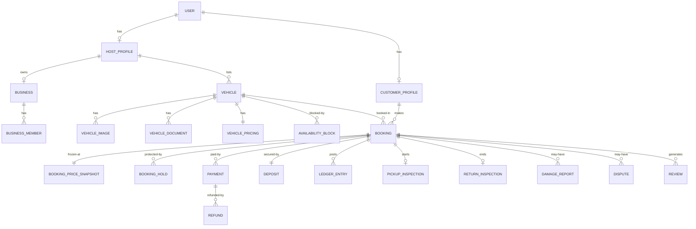

# Hiregari — Database ERD

Authoritative DDL lives in `apps/api/prisma/schema.prisma` (Prisma + PostgreSQL 16).
This document is the narrative ERD and the rationale for constraints.

## Conventions

* All primary keys are `uuid` (`gen_random_uuid()`), never exposed publicly.
* Human-facing identifiers live in `reference` columns (`HG-XXXXX`, `HGV-xxxxx`).
* Money: `<name>Cents Int` (integer minor units, KES = 100 cents/shilling) plus
  `currency CHAR(3)` on every financial record. KES minor unit is the cent even
  though Kenyan shillings are usually rounded to whole shillings.
* Timestamps: `DateTime @db.Timestamptz(6)`, stored UTC.
* Temporal ranges: explicit `startsAt`/`endsAt` pairs plus generated
  `tstzrange` columns used by `btree_gist` exclusion constraints.
* Soft delete where required: `deletedAt`; financial records are never deleted.
* Every table gets `createdAt`/`updatedAt`; financial/state tables are immutable
  after creation except through well-defined status transitions that append
  history rows.

## Entity groups

### Identity & access
- **User** (1) — auth identity: email, phone E.164 unique, passwordHash nullable
  (passwordless possible), googleSubject nullable, status, locale, MFA fields,
  deletedAt/anonymizedAt.
- **Session** — opaque token hash, userAgent, ip, csrfSecret?, expiresAt, revokedAt.
- **OtpChallenge** — channel (SMS/EMAIL/WhatsApp-reserved), purpose, codeHash,
  attempts, expiresAt, consumedAt, rate-limit bucket columns.
- **RoleAssignment** — (userId, role, scopeType GLOBAL|BUSINESS, scopeId,
  grantedBy, expiresAt?). Admin roles and host staff roles both live here.
- **CustomerProfile** (1–1 User) — legal name fields, dob, nationality,
  photoObjectKey, verificationStatus, risk flags.
- **Address** — polymorphic `(entityType, entityId)` owned addresses; fields:
  country (default KE), county, city, neighbourhood, street, landmark, lat, lng,
  `postalCode` optional.
- **ConsentRecord** — purpose, version, grantedAt, ip, withdrawnAt (DPA 2019).

### Hosts & businesses
- **HostProfile** (1–1 User) — type INDIVIDUAL|BUSINESS, status (PENDING/
  VERIFIED/REJECTED/SUSPENDED), submittedAt, decidedAt/by, internal note,
  payout readiness, rating aggregates.
- **Business** — registered name, registration number, KRA PIN (access-
  controlled), phone, email, Address, authorized representative userId,
  verification fields & status, owner hostProfile.
- **BusinessMember** — businessId, userId, staff role, permissions override set,
  status INVITED|ACTIVE|SUSPENDED|REMOVED.
- **VerificationDocument** — ownerType/ownerId (HOST, BUSINESS, DRIVER),
  type, objectKey (private bucket), contentType, issuedAt, expiresAt,
  status PENDING|VERIFIED|REJECTED|EXPIRED, reviewerId, reviewedAt, note.

### Driver verification
- **DriverVerification** — customerProfileId, legal name, dob, nationality,
  idType (KENYAN_ID|PASSPORT|ALIEN_ID), idNumberEnc, licenceNumberEnc,
  licenceIssuedAt/expiresAt, countryOfLicence, selfieObjectKey, status
  (NOT_STARTED|PENDING|MANUAL_REVIEW|VERIFIED|REJECTED|EXPIRED), reviewer
  fields, rejection reasons, providerReference, expiresAt (derived from
  whichever document expires first).
- **DriverDocument** — links VerificationDocument for licence/ID/passport/selfie
  + side (FRONT/BACK/SELFIE).
- **RiskEvent** — userId/bookingId nullable, type, riskScore, signals jsonb,
  resolution, reviewerId (explainable manual review framework).

### Catalogue / vehicles
- **Vehicle** — hostProfileId, businessId nullable, publicReference slug,
  status DRAFT|PENDING_REVIEW|APPROVED|REJECTED|SUSPENDED|ARCHIVED, title,
  make, model, year, category enum, transmission, fuelType, seats, doors,
  engineCapacityCc?, drivetrain (FWD/RWD/AWD), bodyColour?, instantBookEnabled,
  selfDriveEnabled, chauffeurEnabled, ac, rating aggregates, submittedAt/
  decidedAt/by, rejectionReason.
- **VehicleImage** — vehicleId, objectKey, width/height, position, isPrimary,
  altText, status PENDING|VERIFIED|REJECTED.
- **FeatureCatalog** — code (BLUETOOTH, APPLE_CARPLAY, ANDROID_AUTO,
  REVERSE_CAMERA, USB, GPS, CHILD_SEAT, AIR_CONDITIONING...), label, icon.
- **VehicleFeature** — vehicleId, featureCode (join).
- **VehicleDocument** — vehicleId + VerificationDocument-like columns +
  mandatory flag, blocksBookingAt expiry logic; types: REGISTRATION_LOGBOOK,
  COMPREHENSIVE_INSURANCE, THIRD_PARTY_INSURANCE, INSPECTION_REPORT,
  POLICE_CLEARANCE? (configurable). Insurance-specific: insurerName,
  policyNumberEnc, coverType, restrictionsNote — **no system claims insurance
  validity beyond human VERIFIED status** (spec §53).
- **VehicleLocation** — vehicleId 1–1, addressId, lat/lng, pickupInstruction,
  deliveryEnabled, defaultAirportFeeCents.
- **DeliveryZone** — vehicleLocationId/hostId, name (JKIA, Wilson, custom),
  radiusKm, feeCents, isAirport, eligibleArea jsonb.
- **VehiclePricing** — vehicleId 1–1, currency, dailyPriceCents,
  weeklyDiscountBps, monthlyDiscountBps, minimumRentalHours, minimumRentalDays,
  depositRule (FIXED|PERCENT_OF_TOTAL|DAILY_RATE_MULTIPLE configurable),
  depositAmountCents/depositPercentBps, mileagePolicyType (UNLIMITED|
  PER_DAY|PER_BOOKING), includedKmPerDay/Total, excessPerKmCents,
  fuelPolicy (SAME_TO_SAME|FULL_TO_FULL), lateReturnGraceMinutes,
  lateHourlyFeeCents, cancellationPolicyId.
- **PricingRule** — vehicleId, kind (DATE_OVERRIDE|SEASONAL), range,
  dailyPriceCents, minDurationHours — allows date-specific rates.
- **RentalExtra** — vehicleId/global, code (CHILD_SEAT, GPS, ADDITIONAL_DRIVER,
  AIRPORT_PICKUP, FUEL_PACK...), label, dailyCents/oneOffCents, maxQuantity.
- **CancellationPolicy** — code FLEXIBLE|MODERATE|STRICT (+custom), tiers jsonb:
  hoursBeforePickup → refundBps of rental, feeBps, deposit treatment.
- **AvailabilityBlock** — vehicleId, reason MANUAL|MAINTENANCE|BOOKING_BUFFER,
  startsAt, endsAt, range tstzrange, createdById.
- Exclusion constraints prevent overlaps among confirmed booking ranges and
  blocks; holds have a separate constraint filtered to unexpired rows.

### Quoting & booking
- **Quote** — reference, userId, vehicleId, status ACTIVE|CONSUMED|EXPIRED,
  pickup/return datetimes (UTC) + tz, pickupOption (AT_LOCATION|DELIVERY|
  AIRPORT), deliveryZoneId, extras selections jsonb, promoCodeId nullable,
  totals snapshot fields, expiresAt, idempotency context hash.
- **QuoteItem** — quoteId, code, label, quantity, unitCents, amountCents,
  kind (RENTAL|EXTRA|DELIVERY|FEE|DISCOUNT|TAX|DEPOSIT).
- **Booking** — reference HG-XXXXX, quoteId, customerId, vehicleId, hostId,
  businessId, mode REQUEST|INSTANT, status (state machine, §03), pickup/return
  scheduled datetimes + tz, pickup option & zones snapshot, mileage limits
  snapshot, cancellation policy snapshot, cancellation jsonb (party, reason,
  policy, computed amounts), amounts snapshot convenience fields,
  confirmedAt, pickedUpAt, returnedAt, cancelledAt, extensionOfBookingId?
  self FK, lockVersion int.
- **BookingHold** — bookingId nullable, vehicleId, userId, quoteId, status
  ACTIVE|CONVERTED|EXPIRED|RELEASED, expiresAt, range; exclusion constraint
  on ACTIVE holds only.
- **BookingStatusHistory** — bookingId, fromStatus, toStatus, actorType/
  actorId, reason, metadata jsonb, createdAt (append only).
- **BookingPriceSnapshot** — bookingId 1–1, currency, subtotalCents, extras,
  delivery, fee, discount, tax, deposit, totalCents, refundableCents,
  commissionBps snapshot, computedAt; the daily rate lines are frozen here.
- **BookingPriceItem** — snapshotId, kind, code, label, qty, unitCents,
  amountCents, metadata.
- **BookingExtraSelection** — bookingId, extraId, qty, unitCents snapshot.
- **BookingAdjustment** — bookingId, kind (LATE|EXCESS_MILEAGE|FUEL|
  DAMAGE|GOODWILL|OTHER), amountCents signed, status PROPOSED|APPROVED|
  DISPUTED|FINAL, createdBy, reason, linked inspection/damage ids.

### Money
- **Payment** — reference, bookingId nullable, provider MPESA|CARD, method
  (MPESA_STK|MPESA_MANUAL|CARD_TOKENIZED), status (§04), amountCents,
  currency, purpose RENTAL|DEPOSIT|EXTENSION|ADJUSTMENT, providerRef,
  providerPayload jsonb (safe metadata only), failureCode/Message,
  idempotencyKey unique, initiatedBy, expiresAt?; multiple per booking allowed.
- **PaymentWebhookEvent** — provider, eventId (unique per provider),
  signatureValid bool, raw payload hash, status RECEIVED|PROCESSED|
  FAILED|IGNORED, attempts, lastError, processedAt (idempotency table).
- **Refund** — reference, bookingId, paymentId, depositId nullable, amountCents,
  currency, reason, actorType/actorId, providerRef, status PENDING|PROCESSING|
  SUCCEEDED|FAILED|REJECTED, idempotencyKey.
- **Deposit** — bookingId 1–1, rule snapshot jsonb, amountCents, currency,
  status (§05), paymentId, releasedCents, deductedCents, reason codes jsonb,
  scheduledReleaseAt, finalizedAt.
- **LedgerAccount** — code (e.g. `CUST_WALLET`, `HG_CASH`, `HOST_PAYABLE:<id>`,
  `HG_COMMISSION`, `HG_DEPOSIT_LIABILITY`, `HG_TAX_PAYABLE`), type
  ASSET|LIABILITY|EQUITY|REVENUE|EXPENSE, currency.
- **LedgerEntry** — accountId, entryType DEBIT|CREDIT, amountCents, currency,
  bookingId/paymentId/payoutId/depositId/refundId nullable, externalRef,
  memo, idempotencyKey unique; append-only (BEFORE UPDATE/DELETE trigger
  blocks mutation). A **LedgerPosting** group id ties balanced double-entry
  sets (`postingGroup` column, CHECK sum debits=credits enforced in service
  + SQL assertion helper).
- **Payout** — hostId/businessId, bookingId(s) via PayoutBooking join,
  grossCents, commissionCents, adjustmentsCents, netCents, currency,
  status (§06), scheduledFor, providerRef, failureReason, finalizedAt.
- **PromoCode** — code, scope, kind PERCENT|FIXED, valueBps/amountCents,
  caps, valid window, maxRedemptions, perUser once, minBookingCents, active.
- **PromoRedemption** — promoId, userId, bookingId, amountCents.

### Rental operations
- **PickupInspection** — bookingId 1–1, submittedBy both parties flags,
  odometerKm, fuelPercent/fuelLevel enum, locationPoint, notes, signedAt
  renter/host, createdAt; immutable after both signatures (corrections →
  new amendment rows).
- **ReturnInspection** — bookingId 1–1, same shape + actualReturnedAt,
  distanceKm computed, lateMinutes computed.
- **InspectionPhoto** — inspectionType PICKUP|RETURN, inspectionId,
  objectKey, angle (FRONT/REAR/LEFT/RIGHT/INTERIOR/DAMAGE_CLOSEUP),
  label, uploadedById, createdAt; append-only.
- **InspectionAmendment** — original inspection link, changed fields,
  actor, reason (evidence is never silently edited).
- **DamageReport** — bookingId, reportedByParty, description, category,
  estimatedAmountCents, status REPORTED|ACKNOWLEDGED|UNDER_REVIEW|ACCEPTED|
  REJECTED|ADJUSTED|CHARGED, linkedInspectionPhotoIds jsonb, decidedBy/At.
- **Dispute** — bookingId, openedBy, subject (DAMAGE|DEPOSIT|REFUND|
  VEHICLE_CONDITION|OTHER), status OPEN|AWAITING_CUSTOMER|AWAITING_HOST|
  UNDER_REVIEW|RESOLVED|CLOSED, resolution, decidedBy/At; linked
  damage/refund/adjustment ids.
- **DisputeMessage** — case notes, attachments, internal flag.
- **IncidentReport** — bookingId, category ACCIDENT|BREAKDOWN|THEFT|
  SAFETY|OTHER, description, lat/lng, photo keys, policeRef, contactPhone,
  status SUBMITTED|ACKNOWLEDGED|RESOLVED.

### Trust / engagement
- **Conversation** — bookingId nullable, vehicleId nullable, type
  BOOKING|LISTING|SUPPORT; participant user ids via ConversationParticipant;
  lastMessageAt.
- **Message** — conversationId, senderId nullable (system nullable), kind
  TEXT|IMAGE|SYSTEM, body, attachmentKey, systemEventType, read tracking.
- **Review** — bookingId unique, reviewerId, subjectParty HOST|RENTER|
  VEHICLE, dimensions jsonb (accuracy/cleanliness/pickup/host/overall or
  communication/timeliness/care), comment, visible, moderated status,
  hostReply, submittedAt. Only COMPLETED bookings within window.
- **ReviewReport** — moderation queue.

### Notifications / jobs / ops
- **Notification** — userId, type, channel EMAIL|SMS|WHATSAPP|PUSH|IN_APP,
  status QUEUED|SENT|DELIVERED|FAILED|SUPPRESSED, template, context jsonb,
  scheduledFor, sentAt, providerRef, attempts.
- **OutboxEvent** — transactional outbox: aggregate, type, payload jsonb,
  status PENDING|DISPATCHED; workers drain to notification/analytics/webhook
  handlers (at-least-once, handlers idempotent).
- **JobRun** — name, status, startedAt/finishedAt, error, metadata (the
  in-process queue bookkeeping; BullMQ replaces in staging/prod).
- **AuditLog** — actorId, roleSnapshot, action, entityType, entityId,
  prevValue jsonb, newValue jsonb, reason, requestId, ip, ua, createdAt;
  append-only with trigger protection.
- **AnalyticsEvent** — distinctId (hashed user id), event, props jsonb,
  insertedAt; funnel events per spec §58; PostHog is a sink port.
- **SupportRequest** — bookingId nullable, subject, category, status,
  messages light; external ticketing integration port reserved.

## Critical indexes & constraints (summary)

* Uniques: `User.email` where active, `User.phoneE164`, `Vehicle.slug`,
  `Payment.idempotencyKey`, `PaymentWebhookEvent(provider, providerEventId)`,
  `LedgerEntry.idempotencyKey`, `Review.bookingId+reviewerId+subjectParty`,
  `OtpChallenge` recent-active partial indexes for rate limiting.
* GIST indexes on all tstzrange columns; **exclusion constraints**:
  - confirmed bookings: `EXCLUDE USING gist (vehicle_id WITH =, range WITH &&)
    WHERE status IN (CONFIRMED, PICKUP_PENDING, ACTIVE, RETURN_PENDING,
    PAYMENT_PENDING...)` (payment-pending treated as occupied until expiry job
    releases; holds separate).
  - active holds: `... WHERE status='ACTIVE' AND expiresAt > now()`.
  - availability blocks: no overlap per vehicle.
* Brin/btree composite indexes tuned for search:
  `Vehicle(status, category, locationCity)`, pricing lookups by vehicle;
  booking queues: `Booking(status, scheduledPickupAt)`.
* `btree_gist` extension enabled in the first migration.
* Constraints: all money `>= 0` where semantically non-negative; ledger
  `amountCents > 0`; CHECK status enum values via Prisma enums; deposit
  `releasedCents + deductedCents <= amountCents`.
* Immutable triggers on `LedgerEntry`, `AuditLog`, `BookingStatusHistory`,
  `InspectionPhoto` (raise on UPDATE/DELETE; corrections via new rows).

## Diagrams (Mermaid core loop)

